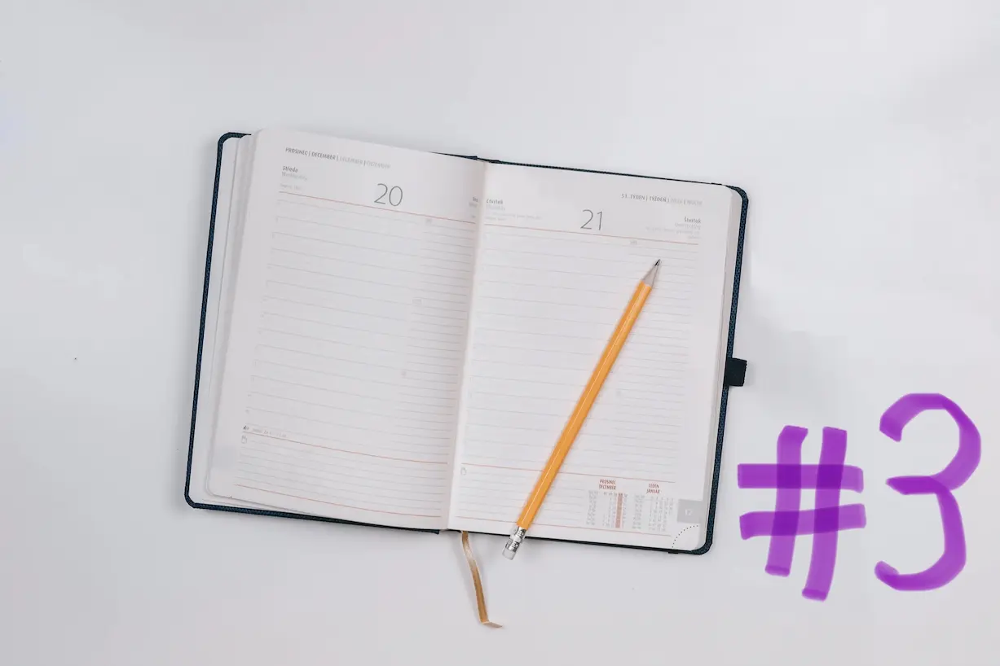
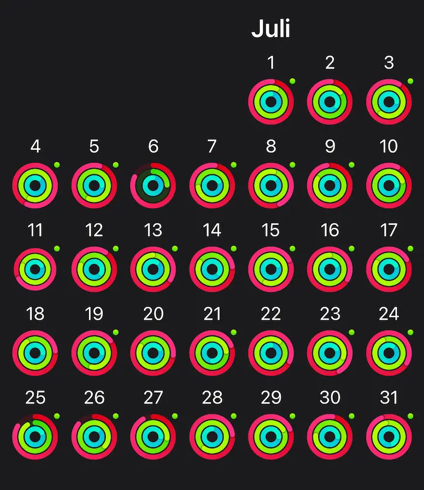

It’s August already which means recapping everything that happened in July! July was a different month. A lot of heat in southern germany. With almost no AC’s here we are not that used to it. 

 

## Work

Work wise this month started quiet. The month before was already quiet because of our wedding, our little honeymoon and of course my covid infection. This meant for july: getting back into the game. I did a lot of what you may call marketing? But I’m not sure if it’s the right term.

I produced a lot of content for my own website. Wrote blog posts, wrote today-I-learned posts. Re-organized some stuff on it, added some [recent projects](/work/#projects) so people can see what I worked on so far.

Besides that I tried to get into SEO for real for the first time. And man, you can get into some deep rabbit holes in this topic. I tried out the <a href="https://bloggingfordevs.com/" target="_blank">blogging for devs e-mail course &#8599;</a> by <a href="https://twitter.com/monicalent" target="_blank">Monica Lent &#8599;</a> and totally recommend it. I learned a lot about SEO and tools I could immediately use to improve my website and blog.

Also I’m pretty happy that I discovered the <a href="https://ahrefs.com/webmaster-tools" target="_blank">ahref webmaster tools &#8599;</a>. It’s a massive collection of SEO tools. It can crawl your website and show you errors like broken links, broken redirects, 404's. I’m planning to write a whole blog post on easy SEO fixes because I learned so much when using this tool.

Additionally we almost finished a project for a good cause. It’s the website for the <a href="https://aerosolalliance.com" target="_blank">Aerosol Alliance &#8599;</a>. It has the goal to reduce the emissions of spray cans. My friends from <a href="https://studiovierkant.de/" target="_blank">Studio Vierkant &#8599;</a> work in the spray paint industry and they’re collaborating with manufacturers on this topic. It’s really exciting!

 

## Blog posts of the month

July was one of the best months for me, concerning writing. I managed to publish 3 blog posts. And I’m very happy with everyone of them. I had a lot of fun writing them. Here are the blog posts of the month:

- [Web developer diary #2](/blog/web-developer-diary-02/)
- [The mistakes I made using react](/blog/the-mistakes-i-made-using-react/)
- [Just hit publish](/blog/just-hit-publish/)

 

## TIL posts of the month

The Today-I-learned collection grew aswell! It’s getting bigger and bigger every month. It feels so cool to have this big selection of things I learned, documented so well for the future me. Here are the Today-I-learned posts of july:

- [Data fetching in react 18](/today-i-learned/data-fetching-in-react-18/)
- [Efficiently load third-party javascript](/today-i-learned/efficiently-load-third-party-js/)
- [HTML sanitizer api](/today-i-learned/html-sanitizer-api/)
- [Array Sort modifies the original array](/today-i-learned/array-sort-modifies-original-array/)

 

## Everything else than web dev

Talking about everything else then web dev, I really liked this month. I had some time to pursue some private projects. I loved getting back into working out and reading a lot.

### 🏋🏻‍♀️ Fitness & health

With my covid infection last month, I needed to take some time in the beginning of the month for recovery. I didn’t wanted to take any risk. After some time I started again with small and light almost daily workouts. And I felt really good! I think that's also visible in my rings:

I noticed how I got stronger again. I played a lot with my rings and I almost forgot how much fun they are!

### 📚 Reading

This was my best month concerning my reading challenge. I know it’s not about the amount of books I read, but I took a lot of time to read which makes me happy. I read some great books and can recommend all of them. My favorite one was where the crawdads sing by Delia Owens. I could feel how I get drawn into this world. And that is clear a sign of a fantastic book.

Here are the books I read in july:

- <a href="https://www.goodreads.com/book/show/50993.East_of_the_Mountains" target="_blank"> East of the mountains - David Guterson &#8599;</a>
- <a href="https://www.goodreads.com/book/show/40404801-notes-on-a-nervous-planet" target="_blank">Notes on a nervous planet - Matt Haig &#8599;</a>
- <a href="https://www.goodreads.com/book/show/36809135-where-the-crawdads-sing" target="_blank"> Where the crawdads sing - Delia Owens &#8599;</a>

### 🕹 Video Games

I picked up Mario Odyssey again, which I haven’t finished, although I bought it 3 years ago. But the day will come where I’m gonna collect all the moons. Also I got pretty excited when I noticed that fall guys was released on the switch. It’s just so much fun.

After a longer break I also got back into Elden Ring. And man, this game is still so good. I’m somewhat over 100h in and Level 138.  I feel like I’m getting closer to the end and I just don’t want it to finish. I hope there will be a DLC soon. I tried out a new build and I’m having a blast. 

### 🎙 Podcasts

I picked up two episodes of <a href="http://Syntax.fm" target="_blank">Syntax.fm &#8599;</a> which made me really interested to dig deeper. The first one was <a href="https://syntax.fm/show/467/stopping-malicious-actors" target="_blank">stop malicious actors &#8599;</a> where Wes and Scott talked aber super interesting web security topics like API-rate-limiting, mistakes with an IP based approach, DDOS, nonce-tokens, captchas, CSRF (cross site request forgery). 

So many topics to learn more about! I’d love to get more into web security one day. And I will definitely write some blog posts about it soon!

The second episode I listened to was <a href="https://syntax.fm/show/446/making-content-what-is-our-process-youtube-blog-posts-courses-conference-talks-and-podcasts" target="_blank">Making Content × What is our Process? Youtube, Blog Posts, Courses, Conference Talks, and Podcasts &#8599;</a>. Wes and Scott share there approach of producing content and explain more about what works for them and what doesn’t. Very inspiring and I could take away a lot for my own content producing process!

That’s it for **july 2022** in the web developer diary series. See you next
month!
