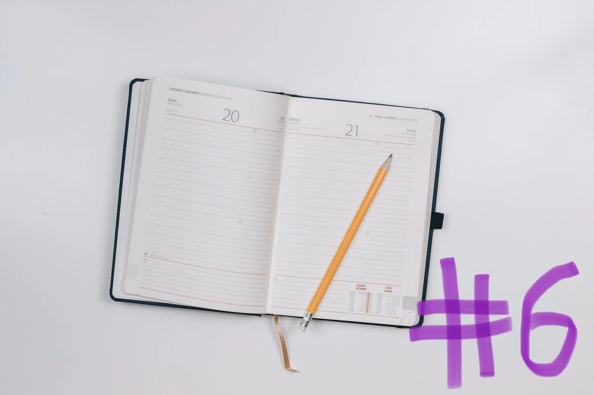
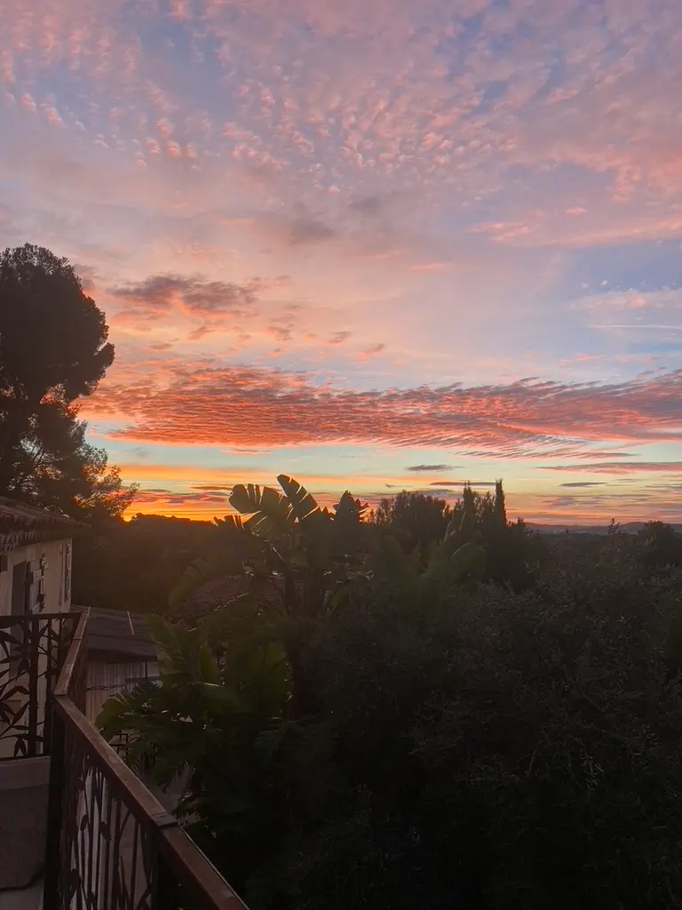
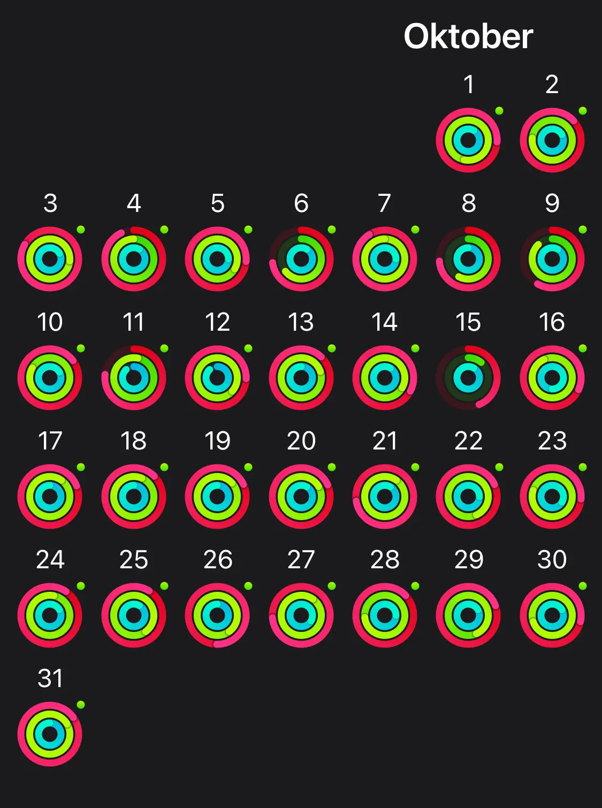

October was a mix of everything. From jumping out of summer straight into cold and dark weather in Germany, seeking new opportunities, car problems, and investing more time into learning again.

 

## Work

In the first two weeks of October, we were still on workation in the south of France. This was a fantastic experience. I wrote a whole blog post about it, and I can’t wait to do it again.

At the end of October, one of my favorite work projects **ended**. It wasn’t a big surprise that it ended. It wasn’t a bad ending. Initially, I needed to help with the project because one of the leading developers wasn’t available for three weeks. So we planned that I should help out during August.

That turned into me working on this project for three months. It was a lot of fun working with awesome people. I learned a lot, and it was not the last time working together. They left me with such [fantastic feedback](/#testimonials). It puts such a big smile on my face whenever I read it.

**New Opportunities** came up, and with my friend Tobi from <a href="https://www.werk8.design/" target="_blank" rel="nooper noreferrer">Werk8 &#8599;</a>, we already planned projects for next year, possibly one of our biggest ones. Exciting times!

One of my key learnings as a freelancer is that it’s always a constant struggle between having less work and not too much work. I have no clear vision of how to handle this long-term, but I think that’s a thing you’ll learn with more experience.

 

## Blog posts of the month

October was my best month for blogging. I published a blog post every week, which felt amazing, and I’m proud of it. **Scheduling** the first 25 minutes of my day for writing was a **game-changer**. This feels like the perfect time for me to write.

Here are the blog posts for October:

- [Workation](/blog/workation/)
- [Fixing my SEO mistakes](/blog/fixing-my-seo-mistakes/)
- [Learnings from my last job](/blog/learnings-from-my-last-job/)
- [Web Developer Diary 05](/blog/web-developer-diary-05/)

 

## TIL posts of the month

I’m trying to establish Wednesday as my today-I-learned day. Here are the today-I-learned posts of October:

- [Secure JavaScript URL validation](/today-i-learned/secure-javascript-url-validation/)
- [Worlds highest website](/today-i-learned/worlds-highest-website/)
- [Squoosh App](/today-i-learned/squoosh-app/)

 

## Everything else than web dev

### 🏋🏻‍♀️ Fitness

I felt terrific during October, health, and Fitness wise. During our workation, we started every day by doing yoga or a short workout on our balcony. It was almost too good to be true because the sun would rise during our training, and we were greeted every day by this view.

As you can see below in my apple rings, I could close them almost daily. And the funny thing is, you can exactly spot when we traveled back from France.

### 📚 reading

Holidays and time spent not at home meant a lot of time for reading. I managed to finish three books.

- <a href="https://www.goodreads.com/book/show/23602561-the-cartel" target="_blank" rel="noopener noreferrer">The Cartel (The Power of the Dog #2) &#8599;</a> by Don Winslow
- <a href="https://www.goodreads.com/book/show/61100819-freizeit" target="_blank" rel="noopener noreferrer">Freizeit &#8599;</a> by Karla Kaspari
- <a href="https://www.goodreads.com/book/show/59828197-man-vergisst-nicht-wie-man-schwimmt" target="_blank" rel="noopener noreferrer">Man vergisst nicht wie man schwimmt &#8599;</a> by Christian Huber

### 🕹Video Games

Nothing on here at all. But: I’m looking forward to the release of the new pokemon games in November, still trying to figure out if I should choose scarlet or violet.

### 🎙Podcasts

I didn’t listen to any podcasts.

That’s it for October 2022. See you next month!