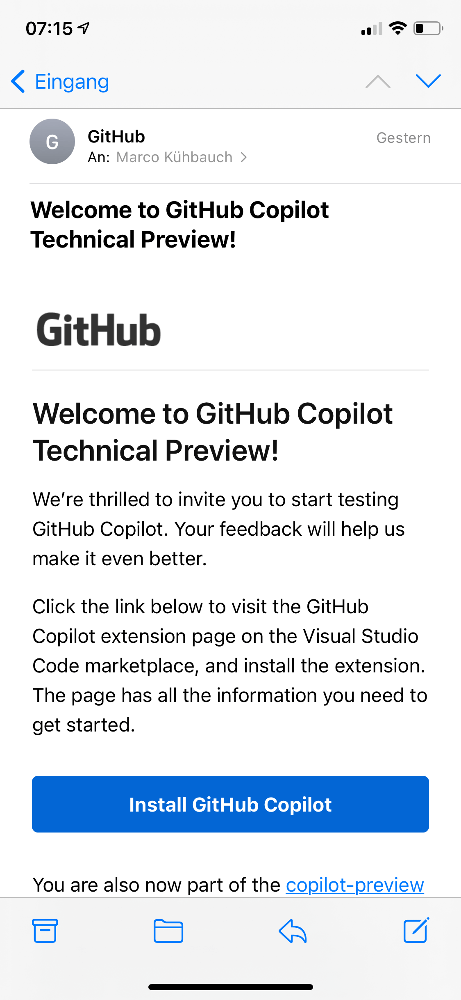

<a
  href="https://unsplash.com/@anthonytran"
  target="_blank"
  rel="noopener noreferrer"
>
  Photo by Anthony Tran
</a>

It's not. And never will. You can **relax** and stop searching for alternative
career ideas. In my opinion Github Copilot is one of the **best things** that
could happen to us developers in the current state of (web) development.

In this blog post I will explain why I think this is the case.

**What you can learn from this blog post:**

---

- [What is GitHub Copilot](#what-is-it)
- [What can GitHub Copilot do](#what-can-it-do)
- [Why it's not stealing our developer jobs](#why-its-not-stealing-our-jobs)

---

##  What is GitHub Copilot

GitHub Copilot was announced on June 29th 2021 as your **AI pair programmer**.
You can read the introduction blog pos over here:
[https://github.blog/2021-06-29-introducing-github-copilot-ai-pair-programmer/](https://github.blog/2021-06-29-introducing-github-copilot-ai-pair-programmer/)

It claims to **help you write better code**.

> GitHub Copilot draws context from the code you’re working on, suggesting whole
> lines or entire functions. It helps you quickly discover alternative ways to
> solve problems, write tests, and explore new APIs without having to tediously
> tailor a search for answers on the internet.

> As you type, it adapts to the way you write code—to help you complete your
> work faster.

As soon as I read the announcement I was hyped. I was tired of writing the same
JavaScript code over and over again. Mapping over arrays, manipulating part of
the data and returning it as some sort of HTML. Sometimes I feel like I'm
**doing nothing else than that**.

I immediately felt like I knew where GitHub Copilot would make my life easier.
Without getting scared that it would do ALL the work.

##  What can GitHub Copilot do

As I saw the first few posts coming in from people who where lucky enough to try
it out, I felt supported in my gut feeling, in my assumption in what Github
Copilot could do - and what not.

People showed how GitHub Copilot knew where they were going when writing a
specific function. It took the **tedious work** from their shoulders by writing
out the detailed specifics for them. And this was so cool to see.

I entered my email to join the waiting list and after a few weeks I got the
invitation to the repository and was able to install the Visual studio code
extension.

My first few tries were pretty basic. I defined a function and GitHub Copilot
knew by the name of this function what logic I wanted to write inside of it.

I created a new file, imported React and it suggested the skeleton of a whole
functional component.

I started to use the [Array.prototype.map](http://array.prototype.map) function
on an Array of data I got from a GraphQL query and it suggested to manipulate
parts of the data and knew how to return it as semantic HTML.

I'm still at the beginning of using the advantages of GitHub Copilot but I
already miss it here in Notion where I'm writing this blog post as there are no
suggestions.

**But GitHub Copilot is not just auto-completion**. You can turn **comments into
code**. You can use it to write repetitive code. It can even write **tests** for
you. And it can show you how to write a certain part of your code in a different
way.

I already notice how this makes me **faster and more confident**. I really feel
like I have a copilot with me all the time, a second pair of eyes, supporting me
and making my code less error-prone.

This gives me a lot of **confidence when tackling new problems**.

Maybe this will eliminate the time spent on searching the internet and
understanding how `Array.prototype.reduce` works for the 317th time.

I also can image that GitHub Copilot will make learning and working with a
language you're not that familiar with a way better experience.

This are just my first impressions on it. You can checkout the documentation
here: [https://copilot.github.com/](https://copilot.github.com/)

It shows a lot of detailed examples and usecases.

## Why it's not stealing our developer jobs

So when this GitHub Copilot is doing all our work, is it stealing our jobs?

Do we still need people to program? Do we still need human beings for web and
software development?

<CoffeeHint />

Of course this is a highly philosophical and controversial questions because it
points into the direction of "Can AI take over?".

I'm no expert in AI at all and in no means can I answer this questions. **But I
know that GitHub Copilot will not steal our jobs**.

I know this could sound naive and maybe in a few years we're all unemployed and
you can tell me: "I told you so". But I strongly believe that this is not the
case.

My assumption is, that **AIs like GitHub Copilot will help and support us**.
They will make our lives easer. But this doesn't mean we won't have jobs
anymore.

This means we have more time to care for the more complex and bigger problems,
we claim to solve with web and software development.

This means we can solve some tasks faster and have more energy for higher
obstacles.

In the end a human being is always needed to point something like GitHub Copilot
into a certain direction. We have to tell it what kind of function we want to
write, to solve this problem in a certain way.

The **creativity** comes from us, that's one of humans biggest strengths. I know
that AI can become creative too, as we've seen with numerous examples of AI
creating art and music.

But I strongly believe that the best outcome will always be achieved **when
humans and AI work together**.

We're still at the very beginning and GitHub Copilot will learn more and more
about how we program. I'm very excited how this turns out.
