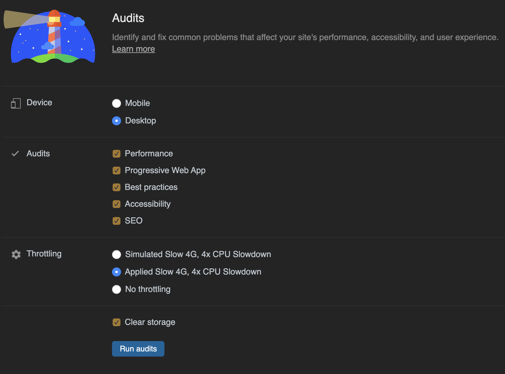
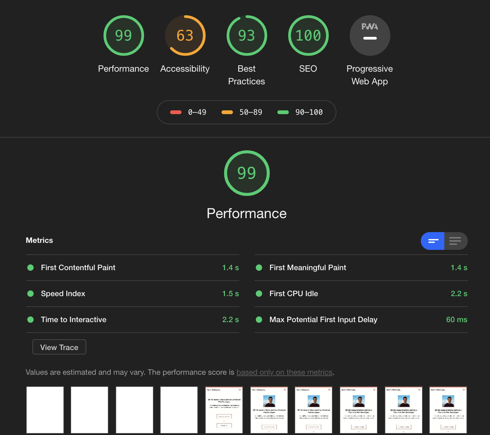

In this blog post I'm going to introduce several tipps and tricks to boost the **performance** of a React application.

I learned a ton while improving the performance of a large and complex web application recently and wanted to share everything so others don't have to search all over the internet for this useful and important information.

---

- [Where to start](#where-to-start)
  - [Chrome DevTools Lighthouse Audit](#lighthouse-audit)
  - [webpagetest](#webpagetest)
- [The Biggest Problems](#the-biggest-problems)
  - [Time to Interactive (TTI)](#time-to-interactive)
- [And how to solve them](#how-to-solve-them)
  - [Removing DOM nodes](#removing-dom-nodes)
  - [lazy-loading images](#lazy-loading-images)
  - [code-coverage](#code-coverage)
  - [code-splitting](#code-splitting)
  - [React Profiler](#react-profiler)
  - [Chrome Performance Analyzer](#chrome-performance-analyzer)
  - [Bundle-Analyzer](#bundle-analyzer)
- [Conclusion](#conclusion)
- [Sources](#sources)

---

##  Where to start

If you notice that your React App is **slow** or takes a long time to load, you have a few options to verify that and get an insight into where the biggest problems are.

###  Chrome DevTools Lighthouse Audit

First of all you can measure your performance score with the **Chrome Lighthouse Audit** which is available in the Chrome DevTools.

You can choose between measuring the performance on mobile or desktop. If you just want to get your performance score, you can check off the other audits, like Progressive Web App or SEO.

You should also activate **throtteling**, because not everyone is on the newest MacBook Pro with 64GB of RAM and i9 processor while browsing on a 5G network. I usually use Applied Slow 4G, 4x CPU Slowdown.

After the audit is finished, you get a nice **overview** over the scores, the metrics and how they are calculated. You also get opportunities and diagnostics which can tell you why your app is slow and how to solve common problems.

###  webpagetest

Another tool to verify the perfomance of your React application is [webpagetest.org](webpagetest.org). After you enter a URL and start the test, it returns a test result and grades specific parts of your application. It is also pretty useful in finding problems and ways to improve the performance.

##  The Biggest Problems

###  Time to Interactive (TTI)

In case of React applications where a lot of JavaScript is involved, often the **time to interactive** identifies itself as the biggest problem. TTI means how long it takes a page to become **interactive**.

The TTI gets slowed down by a few things. The ones which are directly related to a lot of JavaScript code and therefore React are:

- too much main-thread work
- an excessive DOM size
- too much JavaScript execution time

To summarize this: When a user navigates to your page and can not click around for a few seconds, because your JavaScript is not fully parsed, compiled and executed, this is **bad**.

Especially when you are using server side rendering where the user already can see your page but not interact with it yet.

This all happens because your browser has to execute too much JavaScript at once, because certain scripts are blocking, because you just want to do too much at once in your code.

Uff. This sounds a little exausting. We need solutions. Let's tackle the problems one by one.

##  And how to solve them

###  Removing DOM Nodes

Perhaps the easiest step to improve the performance of your react application is to **reduce** the amout of DOM Nodes. If you hide a lot of your components with CSS, check if you can render them **conditionally** instead.

This decreases the size of the DOM which means less components need to be rendered, which means less JavaScript needs to be executed.

This will especially be helpful, when you have a long list of items, render all of them, but show only the first 5 initially. Robin Wieruch has a [great article](https://www.robinwieruch.de/conditional-rendering-react.) on conditional rendering in React.

###  lazy-loading images

If you load twenty images initially, which are located at the bottom of your page, meaning the user can't see them at first glance, this is a lot of wasted time and potential.

Instead you can detect when the user gets closer to the images and then render them. Because that's the point where you actually need them. The npm package [react-lazyload](https://www.npmjs.com/package/react-lazyload) makes this surpringsingly easy.

This results in executing less JavaScript code but it also solves another very common problem: too many **http requests**.

So its a good idea in general to only render and show the code the user needs to interact with your React app initially, instead of just rendering everything.

###  code-coverage

Chrome offers the opportunity to detect **unused** code in your application.

The code coverage tab is located in the Chrome DevTools. You can find it in the command menu when you type _coverage_.

It can track a whole reload of your application and is still tracking and updating the code coverage when you're interacting with your application.

This is another super easy quick win, which can help you to improve your performance by removing **unused code**.

###  code-splitting

In a large and complex react application code-splitting is possibly one of the best ways to improve your performance.

The idea of code-splitting is to split your code in ways it is needed in your application and therefore render only the code which is needed for the **current UI**.

Imagine having a Landingpage and a page where you show some articles, let's call it blog. Does the blog need to download and execute code which is only needed on the Landingpage? No!

So you can use clever tools, who are capable of detecting where your code is actually needed and split it up. That's code-splitting.

One of these clever tools is **React.lazy**. You can read and learn more about it in the [React docs code splitting section](https://reactjs.org/docs/code-splitting.html#reactlazy). Please note that React.lazy is not available for server-side-rendering. Code-splitting in a server rendered app can be achieved with [Loadable Components](https://loadable-components.com/docs/server-side-rendering/).

###  React Profiler

The [React Profiler](https://reactjs.org/blog/2018/09/10/introducing-the-react-profiler.html) is another useful tool to gain more insight about what your React app is doing and why. It is part of the React Browser Plugin and can be located in the DevTools.

When you **profile** your app it collects timing information about each component that is rendered. It also shows how long a specific component took to render, if it needed to be updated and so on.

So you can either see if a component took way to long to render or identify unecessary rerenders. Both are ways which can help you to identify performance bottlenecks.

###  Chrome Performance Analyzer

Another way to collect information about your performance is the Chrome Performance Analyzer. It's also located in the Chrome DevTools and lets you record the load performance of your app. This is the place where you analyze your loading time in to the deepest. It just has so many options.

Take your time to read through the [documentation of this performance evaluation tool](https://developers.google.com/web/tools/chrome-devtools/evaluate-performance/reference).

It makes sense to spent more time to fully understand what this tool is capable of. It can totally help you boost your performance because it shows you everything that's happening with your JavaScript.

###  Bundle-Analyzer

The [Webpack Bundle Analyzer](https://www.npmjs.com/package/webpack-bundle-analyzer) is a npm package which "visualizes the size of webpack output files with an interactive zoomable treemap". To use this package your application has to use webpack for the bundling of course.

This Analyzer is such a great tool. It shows you exactly what files you give out to your users, how big they are and also which files should absolutely not be in your bundle.

In case of the large and complex web app I was working on, by using this analyzer we realized that some packages where depending on the whole `lodash` library which is a lot to include in to your bundle if you actually just need one functionality of it.

##  Conclusion

All these steps are great and helpful ways to find out why your React application is slow and how to change that. You don't have to implement all of them, maybe already one of them will help you speed up things. I hope you could learn something here and if you know more ways to boost the performance let me know!

##  Sources:

- https://developers.google.com/web/tools/lighthouse
- https://developers.google.com/web/tools/lighthouse/audits/time-to-interactive
- https://www.robinwieruch.de/conditional-rendering-react
- https://www.npmjs.com/package/react-lazyload
- https://reactjs.org/docs/code-splitting.html
- https://www.freecodecamp.org/news/taming-performance-in-todays-web-app-with-lighthouse-webpack-and-react-loadable-components-b2d3fa04e0ab/
- https://reactjs.org/docs/optimizing-performance.html
