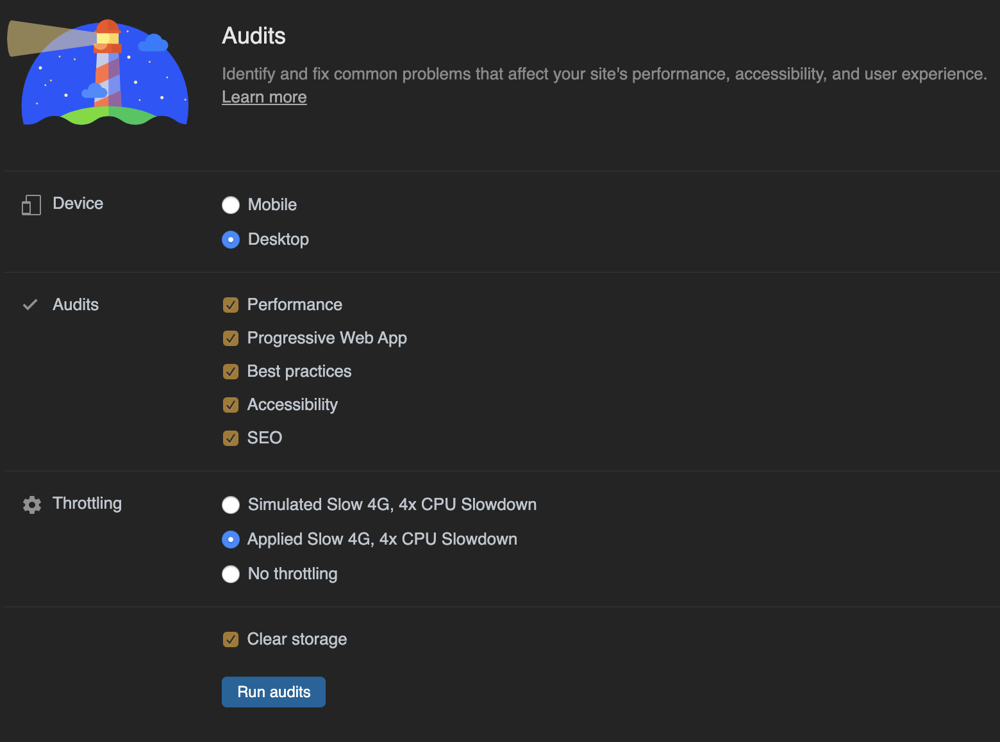
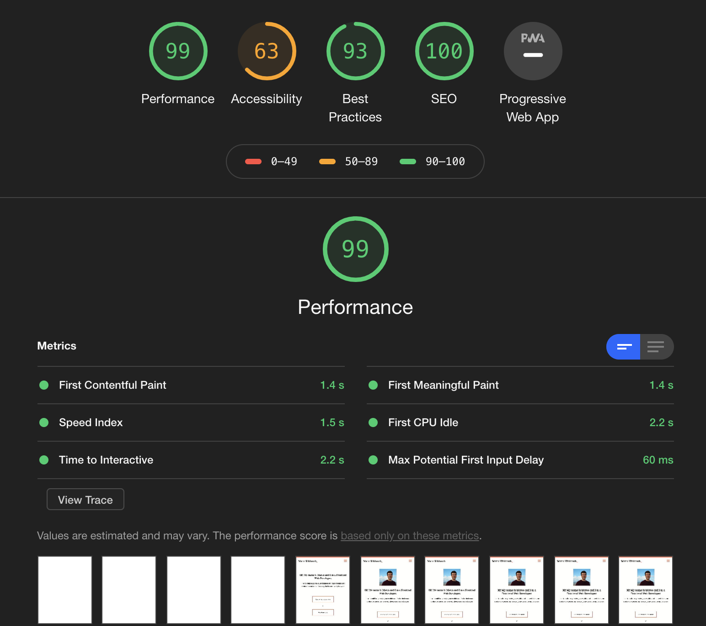
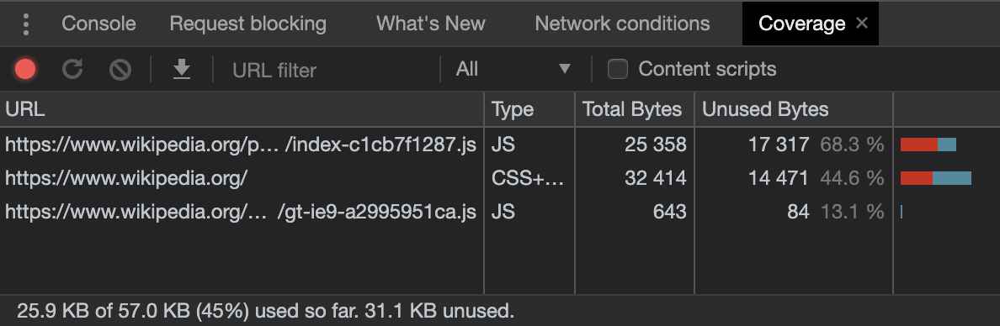

In this blog post I'm going to introduce several tipps and tricks to boost the
**performance** of a React application.

I learned a ton while improving the performance of a large and complex web
application recently and wanted to share everything so others don't have to
search all over the internet for this useful and important information.

**What you can learn from this blog post:**

---

- [Where to start](#where-to-start)
  - [Chrome DevTools Lighthouse Audit](#lighthouse-audit)
  - [webpagetest](#webpagetest)
- [The Biggest Problems](#the-biggest-problems)
  - [Time to Interactive (TTI)](#time-to-interactive)
- [And how to solve them](#how-to-solve-them)
  - [Removing DOM nodes](#removing-dom-nodes)
  - [lazy-loading images](#lazy-loading-images)
  - [code-coverage](#code-coverage)
  - [code-splitting](#code-splitting)
  - [React Profiler](#react-profiler)
  - [Chrome Performance Analyzer](#chrome-performance-analyzer)
  - [Bundle-Analyzer](#bundle-analyzer)
- [Conclusion](#conclusion)
- [Sources](#sources)

---

##  Where to start

If you notice that your React App is **slow** or takes a long time to load, you
have a few options to verify that and get an insight into where the biggest
problems are.

###  Chrome DevTools Lighthouse Audit

First of all you can measure your performance score with the **Chrome Lighthouse
Audit** which is available in the Chrome DevTools.

You can choose between measuring the performance on mobile or desktop. If you
just want to get your performance score, you can check off the other audits,
like Progressive Web App or SEO.

You should also activate **throtteling**, because not everyone is on the newest
MacBook Pro with 64GB of RAM and i9 processor while browsing on a 5G network. I
usually use Applied Slow 4G, 4x CPU Slowdown.

After the audit is finished, you get a nice **overview** over the scores, the
metrics and how they are calculated. You also get opportunities and diagnostics
which can tell you why your app is slow and how to solve common problems.

###  webpagetest

Another tool to verify the perfomance of your React application is
[webpagetest.org](https://webpagetest.org). After you enter a URL and start the
test, it returns a test result and grades specific parts of your application. It
is also pretty useful in finding problems and ways to improve the performance.

 

##  The Biggest Problems

###  Time to Interactive (TTI)

In case of React applications where a lot of JavaScript is involved, often the
**time to interactive** identifies itself as the biggest problem. TTI means how
long it takes a page to become **interactive**.

The TTI gets slowed down by a few things. The ones which are directly related to
a lot of JavaScript code and therefore React are:

- too much main-thread work
- an excessive DOM size
- too much JavaScript execution time

To summarize this: When a user navigates to your page and can not click around
for a few seconds, because your JavaScript is not fully parsed, compiled and
executed, this is **bad**.

Especially when you are using server side rendering where the user already can
see your page but not interact with it yet.

<CoffeeHint />

This all happens because your browser has to execute too much JavaScript at
once, because certain scripts are blocking, because you just want to do too much
at once in your code.

Uff. This sounds a little exausting. We need solutions. Let's tackle the
problems one by one.

 

##  And how to solve them

###  Removing DOM Nodes

Perhaps the easiest step to improve the performance of your react application is
to **reduce** the amout of DOM Nodes. If you hide a lot of your components with
CSS, check if you can render them **conditionally** instead.

This decreases the size of the DOM which means less components need to be
rendered, which means less JavaScript needs to be executed.

This will especially be helpful, when you have a long list of items, render all
of them, but show only the first 5 initially. Robin Wieruch has a
[great article](https://www.robinwieruch.de/conditional-rendering-react) on
conditional rendering in React.

###  lazy-loading images

If you load twenty images initially, which are located at the bottom of your
page, meaning the user can't see them at first glance, this is a lot of wasted
time and potential.

Instead you can detect when the user gets closer to the images and then render
them. Because that's the point where you actually need them. The npm package
[react-lazyload](https://www.npmjs.com/package/react-lazyload) makes this
surpringsingly easy.

This results in executing less JavaScript code but it also solves another very
common problem: too many **http requests**.

So its a good idea in general to only render and show the code the user needs to
interact with your React app initially, instead of just rendering everything.

###  code-coverage

Chrome offers the opportunity to detect **unused** code in your application.

The code coverage tab is located in the Chrome DevTools. You can find it in the
command menu when you type _coverage_.

It can track a whole reload of your application and is still tracking and
updating the code coverage when you're interacting with your application.

This is another super easy quick win, which can help you to improve your
performance by removing **unused code**.

###  code-splitting

In a large and complex react application code-splitting is possibly one of the
best ways to improve your performance.

The idea of code-splitting is to split your code in ways it is needed in your
application and therefore render only the code which is needed for the **current
UI**.

Imagine having a Landingpage and a page where you show some articles, let's call
it blog. Does the blog need to download and execute code which is only needed on
the Landingpage? No!

So you can use clever tools, who are capable of detecting where your code is
actually needed and split it up. That's code-splitting.

One of these clever tools is **React.lazy**. You can read and learn more about
it in the
[React docs code splitting section](https://reactjs.org/docs/code-splitting.html#reactlazy).
Please note that React.lazy is not available for server-side-rendering.
Code-splitting in a server rendered app can be achieved with
[Loadable Components](https://loadable-components.com/docs/server-side-rendering/).

###  React Profiler

The
[React Profiler](https://reactjs.org/blog/2018/09/10/introducing-the-react-profiler.html)
is another useful tool to gain more insight about what your React app is doing
and why. It is part of the React Browser Plugin and can be located in the
DevTools.

When you **profile** your app it collects timing information about each
component that is rendered. It also shows how long a specific component took to
render, if it needed to be updated and so on.

So you can either see if a component took way to long to render or identify
unecessary rerenders. Both are ways which can help you to identify performance
bottlenecks.

###  Chrome Performance Analyzer

Another way to collect information about your performance is the Chrome
Performance Analyzer. It's also located in the Chrome DevTools and lets you
record the load performance of your app. This is the place where you analyze
your loading time in to the deepest. It just has so many options.

Take your time to read through the
[documentation of this performance evaluation tool](https://developers.google.com/web/tools/chrome-devtools/evaluate-performance/reference).

It makes sense to spent more time to fully understand what this tool is capable
of. It can totally help you boost your performance because it shows you
everything that's happening with your JavaScript.

###  Bundle-Analyzer

The
[Webpack Bundle Analyzer](https://www.npmjs.com/package/webpack-bundle-analyzer)
is a npm package which "visualizes the size of webpack output files with an
interactive zoomable treemap". To use this package your application has to use
webpack for the bundling of course.

This Analyzer is such a great tool. It shows you exactly what files you give out
to your users, how big they are and also which files should absolutely not be in
your bundle.

In case of the large and complex web app I was working on, by using this
analyzer we realized that some packages where depending on the whole `lodash`
library which is a lot to include in to your bundle if you actually just need
one functionality of it.

 

##  Conclusion

All these steps are great and helpful ways to find out why your React
application is slow and how to change that. You don't have to implement all of
them, maybe already one of them will help you speed up things. I hope you could
learn something here and if you know more ways to boost the performance let me
know!

 

##  Sources:

- https://developers.google.com/web/tools/lighthouse
- https://developers.google.com/web/tools/lighthouse/audits/time-to-interactive
- https://www.robinwieruch.de/conditional-rendering-react
- https://www.npmjs.com/package/react-lazyload
- https://reactjs.org/docs/code-splitting.html
- https://www.freecodecamp.org/news/taming-performance-in-todays-web-app-with-lighthouse-webpack-and-react-loadable-components-b2d3fa04e0ab/
- https://reactjs.org/docs/optimizing-performance.html
