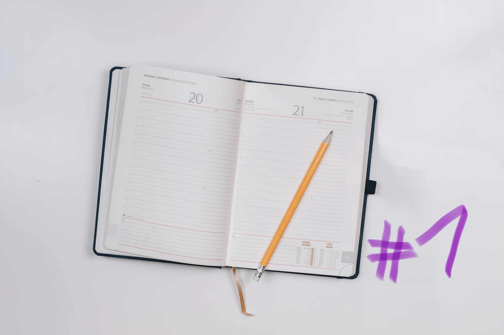
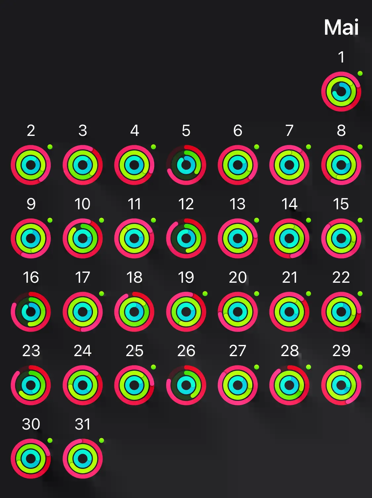

With this blog post, I’ll start a new series: the **Web Developer Diary**
series!

I saw this idea on Dave Ruperts
[blog](https://daverupert.com/2022/05/vibe-check-16/). He calls it vibe check
and it’s a **check-in** at the end of every month, to **reflect** on things that
happened during this month - work-whise and in private.

I really like this format, because I do a monthly reflection on things anyway
with my _“Ein guter Plan”_ planner
([https://einguterplan.de/](https://einguterplan.de/)) (sorry, only available in
german!).

So without any further ado, let’s start this **Web Developer Diary series** and
see what happened in May 2022!

 

## Work

I started **freelancing** back in february with one of the biggest projects I’ve
ever worked on and this month was the time of adding the final touches and
preparing everything for **the big launch**. It’s a NextJS static-generated
website where we used Prismic as headless CMS and vercel for deployment and
hosting. This combination is genuinely so much fun to work with. The site is
predominantly static generated content, but the amount of content is A LOT.

I wasn’t sure how user-friendly Prismic is with a ton of documents and custom
types and if we would lose track immediately. But turns out: their filter and
search functionality is actually great. All the people who were adding content
into the CMS were pretty happy with it, which makes me confident in using
Prismic for bigger projects in the future again.

Besides all the static pages this project also included a lot of **interactive**
parts, which made the development challenging and very exciting. That included
the possiblity of filtering and sorting items, a pretty cool interactive map,
and a powerful search based on
[algolia](https://www.algolia.com/). Implementing
a search with algolia was very intuitive and rewarding. It’s the first time I
used it and I can highly recommand it.

Besides this big project I also worked on some smaller projects, using the tech
stack mentioned above.

For the first time ever I did some **client outreach** by myself. This means
reasearching companies who have bad websites or no website at all and contacting
them with reasons why a great website will benefit them. I took away **three key
learnings** from that:

- A lot of companies still do not have a website and have only a facebook or an
  instagram page and this really shocks me
- A lof of companies still have really bad websites. Using outdated jQuery
  versions, 10s loading times or more, not accessible at all and just looking
  terrible
- It’s really motivational to tell someone why a good website should be
  important and a priority to them. That confirms me in why I do what I do and
  why I like it so much.

 

## Blog posts of the month

Unfortunalety I didn’t find the time to finish a blog post completely this
month. But I have some posts in my “almost finished” columns and I’m pretty
excited to publish them in the next weeks.

I’ve already learned so much in this first few months of freelancing, I could
spend a whole week of just writing down everything I learned and turning that
into blog posts. I hope this web developer diary will bring me back into writing
blog posts regularly again!

 

## TIL posts of the month

I did find the time to add some new Today-I-Learned posts this month, which
makes me really happy.

- [Headless wordpress](/today-i-learned/headless-wordpress/)
- [POST vs. PUT](/today-i-learned/post-vs-put/)
- [Confetti](/today-i-learned/confetti/)
- [Most common accessibility issues](/today-I-learned/most-common-accessibility-issues/)

I also played around a bit with my [Today-I-learned page](/today-i-learned),
added some nice animations and the coolest part: **a search functionality**!
It’s basically just a client-side filter which checks several parts of the posts
with `.includes()` but it works pretty well and I use it a lot!

Stay tuned for more Today-I-learned posts in the next weeks, my draft folder
gets bigger and bigger.

 

## Everything else than web dev

### 🏋🏻‍♂️ Fitness & Health

Concerning working out this month was quite a good one. I managed to close my
rings on my apple watch on 22 days. I missed my standing goal only on 2 days
which makes me very happy.

I managed to fit in one, or two workouts every week. My current workout routine
consists of

- 3 sets of pullups alternating with 3 sets of pistol squats
- 3 sets of pushups alternating with 3 sets of ring dips
- and 3 sets of arching active hang

The last one is my progression path to achieving the front lever one day.

Besides bodyweight exercises I rode my bike a lot and I already can feel how I
get fitter. It's a Focus Atlas 6.7 gravel bike and it was one of the best things
I got myself this year. For me it's the perfect combination between mountain
biking and riding fast and I'm having a lot of fun.

### 📚 Reading

I finished two books this month:

- [The Anomaly](https://www.goodreads.com/book/show/56920684-the-anomaly)
  by Hervé le Tellier
- [Once there were wolves](https://www.goodreads.com/book/show/54860573-once-there-were-wolves)
  by Charlotte McConaghy

I liked them both a lot. The latter even made me shed a few tears.

I also started a new book, it’s
[Postcards](https://www.goodreads.com/book/show/28000.Postcards)
by Annie Proulx and I’m really excited about it. It’s the one book who made her
win her first award. I loved Shipping news and Accordion Crimes and I’m really
interested what this book will be like.

I’m currently at 7 books read this year and my goal are 30. You can follow the
progress of
[my reading challenge](https://www.goodreads.com/user_challenges/31803693).

### 🕹 Video Games

I bought an Xbox Series S back in march only for one reason: I wanted to play
[Elden Ring](https://en.bandainamcoent.eu/elden-ring/elden-ring).
And what can I say: I think this is the best game I’ve ever played. The open
world is so enjoyable to explore, the boss fights are unique and a lot of fun
and I did not have on minute where I regretted buying a new console for the sole
purpose of playing one specific game.

If you’re also playing: I’m currently 84h in and level 100.

I’m no expert in the souls games, I just have a lot of fun playing them. I’m
really curious on how long it will take me to finish this game.

That’s it for **may 2022** in the web developer diaries series. See you next
month!
