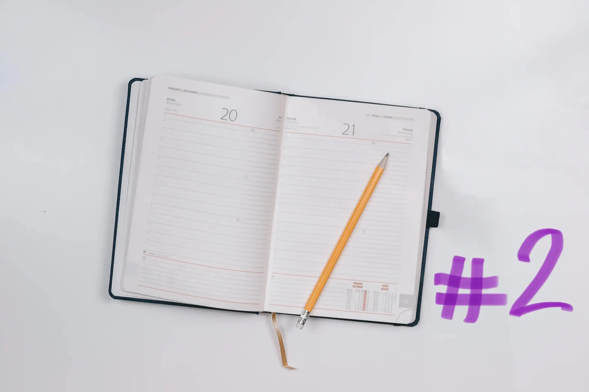
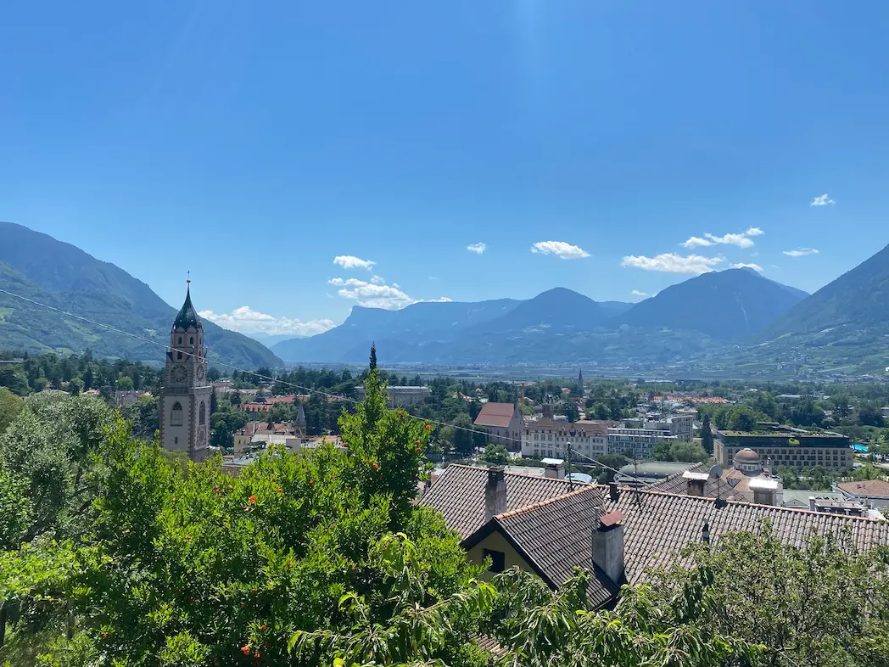
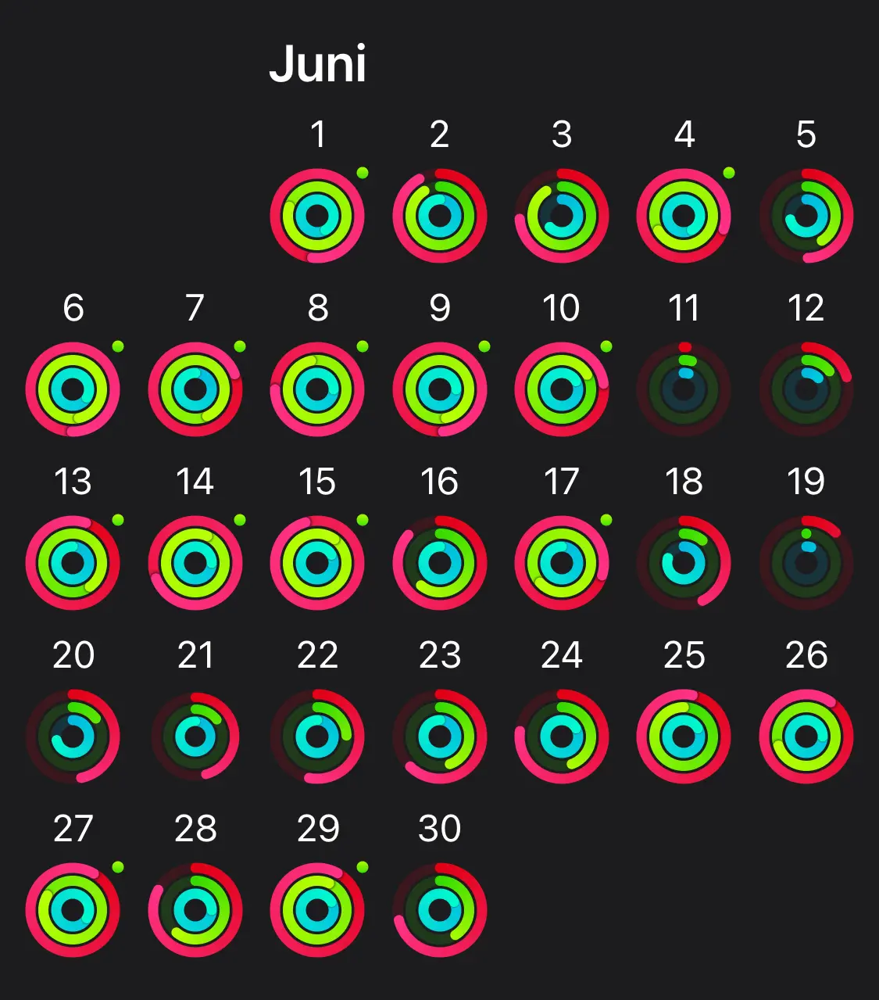

I started this series last month. As we all now, time flies and here we are
again for **web developer diary #2**, the june issue.

June was a crazy month. Less because of work but mainly because me and my wife
got married! It needed a good amount of planning to make sure work won’t get too
stressful this month. Almost all energy and time was needed for the organization
of our wedding.

 

## Work

As I already said, I figured I needed to block a lot of time for others things
than work. That’s why we managed to launch one of the biggest projects I’ve
worked on so far as a freelancer right away at the start of june.

It’s the website [dieda.de](http://dieda.de) and I’m pretty happy with the
result. It has a lot of interactive parts which were a lot of fun to develop. I
worked on it together with my friends from [Werk8](https://www.werk8.design/).
It was our first project together and I think there will be a lot more to come.

The push to production went pretty smooth. We prepared and planned a lot before
hand so we knew that not a lot could go wrong. The only hickup was a little
confusion with the redirects. But we managed to resolve it quickly.

Once again a great go-live checklist is a life-safer in this case. I will
definitely write a blog post soon about how I prepare for a website launch.

The website runs, it’s pretty fast and the client is really happy. Success!

Besides from this big launch I worked on some smaller projects, which were a lot
less work, thanks to
[my starter kit](https://github.com/mkuehb/website-starter-kit). It was really
worth the time I put into this project.

Other than working on client projects I started to produce content again for my
own website. I have a lot of great blog posts almost finished, I can’t wait to
publish! I’m also in the flow of publishing 3-5 today-I-learned posts a month.
It brings me a lot of joy to work on content for my site and I hope I can keep
it up.

 

## Blog posts of the month

I published two blog posts this month. The first one of course was the kick off
of this series, which I enjoyed writing very much. It feels so good to look back
and reflect on what happened and how it shapes the now.

The second blog post was about my
[website-starter-kit](/blog/website-starter-kit/).

 

## TIL posts of the month

I managed to publish 3 Today-I-Learned posts this month, which I’m pretty happy
about.

- [How to write great alt text](/today-i-learned/write-great-alt-text/)
- [Automatic ER diagrams](/today-i-learned/automatic-er-diagrams/)
- [Missusing useEffect](/today-i-learned/missusing-use-effect/)

I got a lot more on my notion doc and my
[today-I-learned page](/today-i-learned) is turning out great. It has got the
different tags you can filter for and the search functionality, which I use a
lot.

 

## Everything else than web dev

As I already mentioned in the beginning: I got married! It was wonderful and
amazing at the same time. A magical experience. I never thought I would say
things like that but that’s the way I feel about it.

We celebrated two wonderful parties. The first one was the official ceremony
with our family and closest friends. The second one was a big party with all the
people we love.

After our wedding we started our honeymoon with a great time in south tyrol. I
get it now why everyone I know loves to go there. Beautiful nature, great food,
great weather, nice people and just a 5 hour drive. And the best thing: it’s
Italy!

### 🏋🏻‍♂️ Fitness & Health

I felt good at the beginning of the month. I did a lot of smaller workouts and
one hour long gravel rides. Due to preparing and celebrating our wedding, I did
not find time for longer workouts or rides. But that didn’t bother me too much.
I felt healthy and fit. Plot twist: than I got Covid.

It’s funny that you can spot the exact time frame when it happened in my apple
watch rings.

I’m negative now and free of symptoms but still recovering. My heart beat is
still pretty high even when I just go for a little walk. I definitely need to
relax for the next two weeks and don’t do anything too heavy.

### 📚 Reading

I finished two books this month:

- [Christian Sauer - Draußen gehen](https://www.goodreads.com/book/show/48715024-drau-en-gehen)
  (only available in german I think)
- [Annie Proulx - Postcards](https://www.goodreads.com/book/show/28000.Postcards)

The first one was about the sane thing of walking outside. The author brings it
into the context of creative techniques. He also explains why it’s beneficial to
your work. I liked a lot of his ideas. Even though if you could summarize it as:
when you’re stuck on a problem, go for a walk.

The second one was Annie Proulx’s famous debut book. It’s just so different from
everything I read and that’s what it makes so special for me.

I also started a new book
[David Guterson - Rast of the mountains](https://www.goodreads.com/book/show/50993.East_of_the_Mountains?ref=nav_sb_ss_1_16).
I’m really into it right now and like the story and where it’s going.

The
[reading challenge](https://www.goodreads.com/challenges/11636?ref=nav_profile_rc)
stands on 9 books read out of 30, so a lot more to go. But I think I’m gonna
make it.

### 🕹 Video Games

Didn’t find a lot of the time to play Elden Ring but got close to the end. I
think I’ve never put so much time into a video game and I don’t regret a minute
of it. Still I’m not feeling it that much right now so maybe take a break of it
for now.

I’m tempted to start playing with my Switch again, haven’t finished Mario
Odyssey!

### 🎙 Podcasts

I listened to the
[Syntax episode about edge functions](<[https://syntax.fm/show/454/wtf-is-the-edge-edge-compute-functions](https://syntax.fm/show/454/wtf-is-the-edge-edge-compute-functions)>).
I’ve heard so much about it and wanted to learn more on this topic. Wes and
Scott talk about what this is all about, the upsides and downsides and what
they’re used for. Can recommend!

That’s it for **june 2022** in the web developer diary series. See you next
month!
