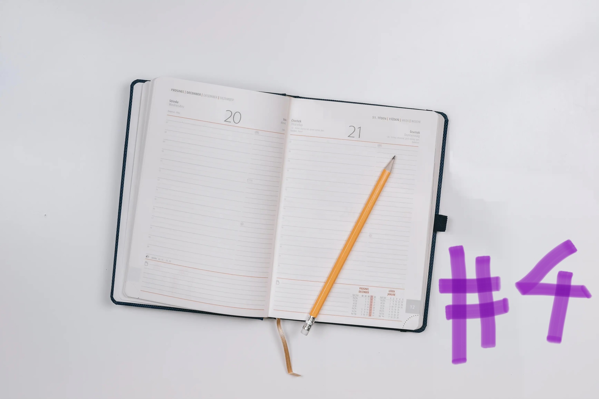

New Month, new web developer diary entry! This time it’s the fourth and I’m writing about everything that happened in august!
 

## Work

I remember from the post last month that I described july as rather slow and quiet. This month was quite the opposite. Lot of new projects, new opportunities and new things coming together. The groundwork I put it in the previous months absolutely paid off. 

It’s super interesting to see the effects of networking in action. 

This reminds me of a pretty common saying: “never burn bridges”. It’s always great to keep communication open to people you’ve previously engaged with. Who knows what’s gonna happen in the future. 

I also never thought that something like a simple twitter direct message could lead to a great time working on a cool project. 

So august: busy month, working for different clients, on different projects. But still fun. I learned a lot of new things and this freelance journey is still an exciting ride.

 

## Blog posts of the month

No other blog post published than the previous version of this series unfortunately. 

- [Web developer diary #3](/blog/web-developer-diary-03/)

Some great posts are almost done but need this half an hour additional fine-tuning before I’m happy with them. 

Couldn’t find the time for that but this means I’ll publish more posts in september! Besides that, one of my recent posts, [just hit publish](/blog/just-hit-publish/) got featured by two amazing people I follow for a long time already.

Jeremy featured it in his <a href="https://adactio.com/links?start=20" target="_blank">link collection &#8599;</a> and Stefan introduced it in his newsletter <a href="https://www.stefanjudis.com/blog/web-weekly-74/" target="_blank">web weekly #74 &#8599;</a>. That made me really happy. It’s awesome to hear that someone liked your writing.

 

## TIL posts of the month

As I already said in the beginning of this pos, I learned some cool stuff this month and documented it as today-I-learned posts. The theme setting without js is probably my favorite one. And I've already integrated the checklist of the a11y project into my developing workflow.

- [Faster page loads with early hints](/today-i-learned-faster-page-loads-with-early-hints/)
- [Setting a theme color without JavaScript](/today-i-learned/setting-theme-without-javascript/)
- [Incomplete list of CSS mistakes](/today-i-learned/incomplete-list-of-css-mistakes/)

 

## Everything else than web dev

### 🏋🏻‍♀️ Fitness & health

I moved a lot this month and could close my rings almost everyday! It's always cool to see that I were this active. Gives me a lot of confirmation why I feel better.

I pushed my workout time to the morning again. But not right out of bed as it’s been like for most of my twenties. My new workout time is right after my morning coffee, so I’m a little more awake and energized and I’m happy with it. This and a very cold shower are my favorit way to start into a new day.

I did not write my bike a lot as I wasn’t in the mood that often this month. I miss it but it wasn't a priority. We're travelling a lot the next weeks, so we'll see when the next time on the bike will be.

### 📚 Reading

I’m in a reading flow and have a lot of fun reading books. I’m still behind my reading challenge of reading 30 books this year, but who cares. 2 books a month is also a lot for me and I notice that more and more situations occure where I grab a book instead of my phone. And that’s all I ever wanted. 

This month I’ve read:

- <a href="https://www.goodreads.com/book/show/57558287-city-on-fire" target="_blank"> City on fire - Don Winslow &#8599;</a>
- <a href="https://www.goodreads.com/book/show/18143977-all-the-light-we-cannot-see" target="_blank">All the light we cannot see - Anthony Doerr &#8599;</a>
- <a href="https://www.goodreads.com/book/show/42046112-recursion" target="_blank">Recursion - Blake Crouch &#8599;</a>

All three of them are great books I can recommand. I think I’m getting better in choosing books I might enjoy. Especially the last one made my mind go crazy. I won't spoil anything but the genre is science-fiction and the main topics are parallel-universes. I dreamed almost every night about it. What a book.

### 🕹 Video Games
I’m dreading the ending of Elden Ring. I’m still in front of the final boss and haven’t touched it since. Instead I switched to Dark Souls 1 on my switch and it’s a lot of fun. I’m curious when I’ll find the courage to actually finish Elden Ring. Or if I’m going to complete Dark Souls 1 first.

### 🎙 Podcasts
I’ve listened to an episode of darknet diares where <a href="https://darknetdiaries.com/episode/121/" target="_blank">Ed Skoudis shares super interesting stories from his job as a penetration tester &#8599;</a>. Some of them are absolutely insane and I couldn’t believe them at first. Web Security is such a fascinating topic. 

That’s it for **august 2022** in the web developer diary series. See you next
month!
