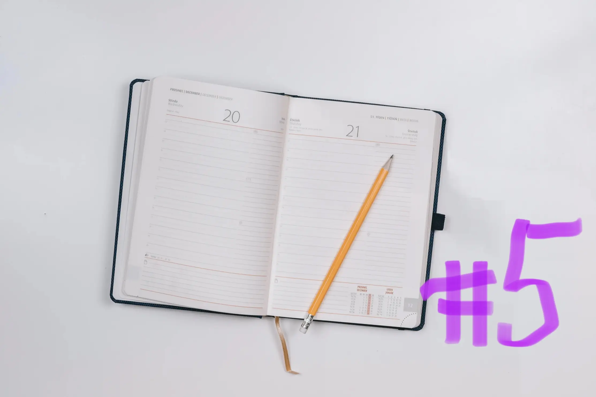
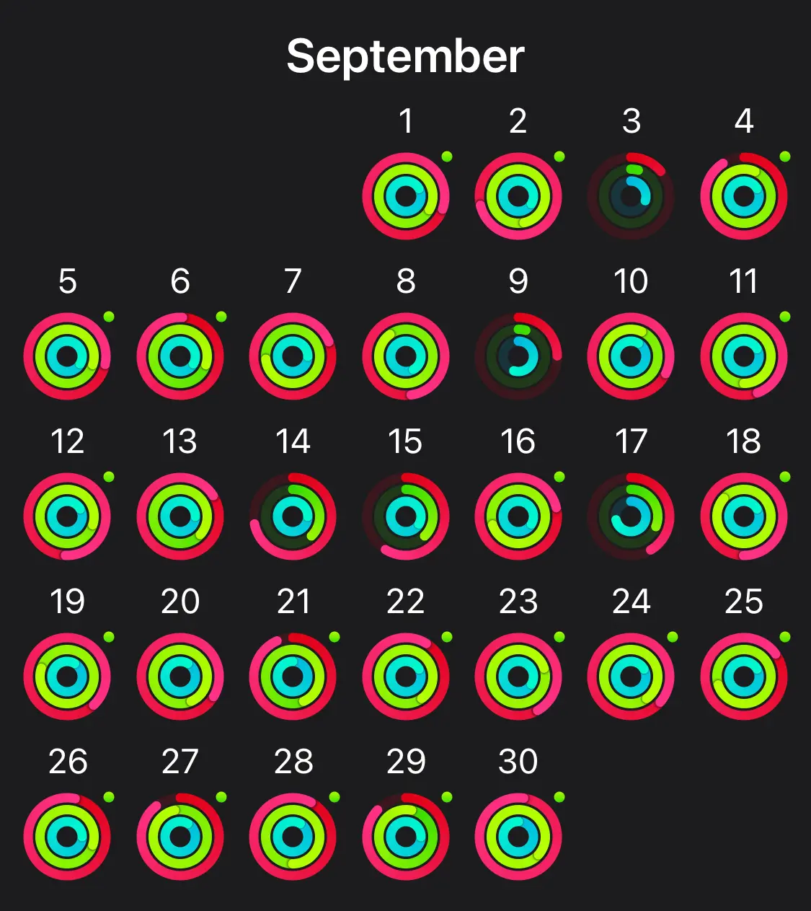

Welcome to Web Developer Diary #05! Another month is over which means I’m gonna reflect on everything that happened in September 2022! Sometimes I’m brave enough to try out new things. And I’m feeling so kind of right now. So here’s the new thing. Try out to describe this month with just one word. And that word would be: **Fun**!

September was packed. We went to two weddings and danced until our feet hurt. We went to see Ed Sheeran in the Olympic stadium in Munich. And we drove 1000km to the south of France with our 20 years old Volvo called Carla.

 

## Work

This month we were using our huge privilege to be able to work from anywhere in the world. At least where the internet connection is good enough to enable two people have video calls at the same time. Without sounding like robots. An where the timezone kind of matches with the people we are working with.

This month I worked out of a hotel room in a small town where our friends got married. I worked in a beautiful co-working space in the WunderLocke hotel in Munich. And I worked in our Airbnb in the south of France on the kitchen table or the terrace while looking at the Mediterranean sea.  

We went here for 4 weeks in total, doing 2 weeks of vacation and 2 weeks of working from here. We always wanted to try out this thing called **Workation**. I’m not gonna spoil too much right now because I’m planning to write a fully detailed blog post on this topic soon.

But what I can say so far: It’s awesome. I imagined it way more stressful when working not from you’re usual workplace, without a big screen and the fastest internet connection possible. But with a little preparation and the correct tools, it works!

 

## Blog posts of the month

I wasn’t in the mood of writing a lot in September, so it’s just these two blog posts:

- [Web developer diary 04](/blog/web-developer-diary-04/)
- [TypeScript Tooling in Prismic](/blog/typescript-tooling-in-prismic/)

Nevertheless, I’m very happy especially about the TypeScript Tooling post, because writing about it made me realize again how much it improves my developer life.

It’s this time of the year again when I’m thinking about writing a blog post a week although already knowing that I can’t manage it. We’ll see how this turns out.

  

## TIL posts of the month

Here are the Today-I-learned posts of the month:

- [The a11y project](/today-i-learned/the-a11y-project/)
- [web-vitals-element](/today-i-learned/web-vitals-element/)

 

## Everything else than web dev

### 🏋🏻‍♀️Fitness

I got a new tattoo which meant 2 weeks of not working out at all. After that I also got sick (not covid thankfully) so another week of not working out. Surprisingly it doesn't show too much in my apple watch rings.
I wonder if I should be happy about this or worried because I moved a lot although not feeling that good. 

After taking enough time to recover, I did a lot of light walks and hikes. I also starting to work out again slowly. Currently, I do it every morning after my morning coffee while watching the sunrise. It's incredible.

I'm trying to convince myself to move every morning in October. We’ll see how that turns out. 

### 📚Reading

Being on holiday means having even more time to read books and I love it! Here are the books I read in September:

- <a href="https://www.goodreads.com/book/show/12497.No_Country_for_Old_Men" target="_blank">No country for old men - Cormac MacCarthy &#8599;</a>
- <a href="https://www.goodreads.com/book/show/206236.The_Power_of_the_Dog" target="_blank">The Power of the dog - Don Winslow &#8599;</a>
- <a href="https://www.goodreads.com/book/show/23602561-the-cartel" target="_blank">The Cartel - Don Winslow &#8599;</a>

### 🕹Video Games

I did not play any video games at all, as we are not at home where my Xbox is. I took my switch with me but did not want to play with it so far. 

I’ve never told this but I started playing Pokemon Go when it came out in 2016 and never stopped since then. So that’s what keeps me busy on this topic!

### 🎙Podcasts

I didn’t listen to any tech-related podcasts at all this month. I wasn’t really in the mood for it. I blame the holidays and me not opening my MacBook once for two weeks. 

That’s it for the recap of September 2022. See you next month!
