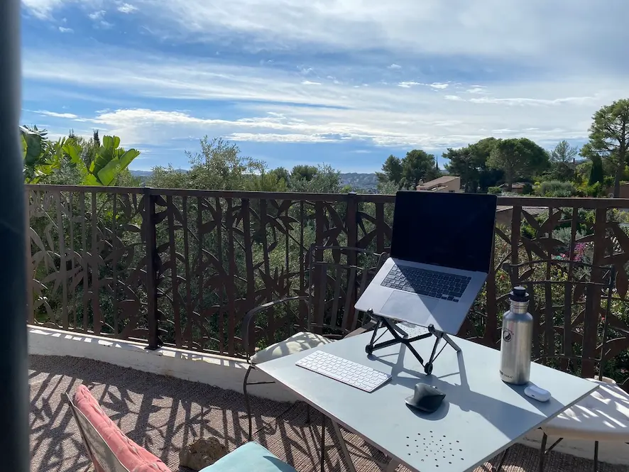
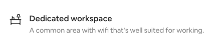
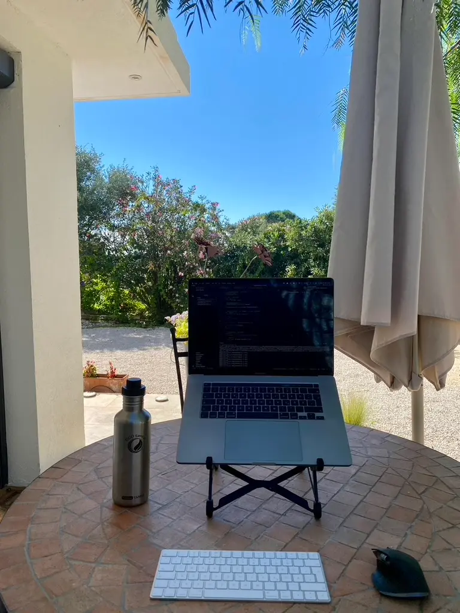

Covid changed the world and showed companies that **remote work** is possible and a valuable alternative to working from an office full-time. In addition, many employees appreciated the fact of **not having to commute** and being able to spend more time with their **families**.

We, as software developers, are one of the very privileged groups who can work from anywhere in the world. We need a laptop and a decent internet connection. We are not bound to a physical place.

This possibility of being able to work from anywhere, combined with the fact of being a freelance web developer, freed me completely. Most of my clients work remotely as well. I've never had to go into a client's office.

I've always wanted to try the concept of **workation**. But working at my desk, taking a break, stepping outside in the sun, and looking at the beach seemed like a ridiculous dream. But, with Covid enabling more remote work and me being a freelancer, deciding for myself where to work, workation seemed possible!

---
**Table of Contents**

- [What is a workation](#what-is-a-workation)
- [How to prepare for your workation](#how-to-prepare-for-your-workation)
  - [Having a decent place to work](#having-a-decent-place-to-work)
  - [Internet connection](#internet-connection)
  - [Safety first](#safety-first)
- [How it went and why you should go too](#how-it-went-and-why-you-should-go-too)
---

 

## What is a workation 

If you've never heard of workation, it combines **work and vacation.** You go wherever you want to go in the world for a holiday. You enjoy it, and you relax. And then you stay a little longer and also work from there.

In September 2022, my wife and I took this opportunity and wanted to try it out. My wife works as a UX designer, and her company enabled her to work from anywhere in Europe for up to a few months a year, which is fantastic.

Our chosen place for our workation was the **south of France**, and we aimed for an eternity of **4 weeks** to test it out. If it worked and we liked it, we wanted to do it as often as possible during the year.

 

## How to prepare for your workation 

If you plan to do a workation as well, here are a few things I recommend to check and plan. When we started looking for a place we wanted to go to, checking these things helped us to decide and feel comfortable that this workation would work well for us.

### Having a decent place to work 

For us, this was the most crucial thing to get right. A small hotel room might be perfect if you're going on holiday. Most of the time, you use it to sleep there and spend the rest of the time outside, at the pool, or on trips.

But if you also plan to spend more time there and mainly work from there, your accommodation needs completely different characteristics. We were looking for at least a separate dining table with few chairs where you can work.

Because let's be honest here. Lying on a beach, working at the bar, or sitting in the sun seems great in theory. Maybe it's incredible for a few days. But for any time longer, you want to have a decent place to work. At least for us, that's the way we felt about this.

Airbnb has this new option where hosts can mark their space as a good workplace.

It could be clearer what the exact criteria are to mark your place as such. Airbnb tries to clear this up in <a href="https://www.airbnb.com/resources/hosting-homes/a/how-to-make-your-space-comfortable-for-remote-workers-236" target="_blank">this article &#8599;</a>.

The accommodation we chose was marked as a place like this. The pictures showed a separate table and a chair which you were able to work on. This made our choice easier because we could imagine how it would be to work from there.

Next to the location itself should offer, there are also some things you can arrange to have the best place to work outside your typical office. For us, this meant bringing some **extra gear**. I got a **laptop stand** and a **Bluetooth mouse** and **keyboard** to prevent staring down at my laptop for four weeks and hurting my neck.

This was a great idea so we could have at least some kind of **ergonomic environment**.

### Internet connection 

Checking that the place you want to spend your workation has a good internet connection is mandatory. So that's one of the first things we did when we looked for accommodation on Airbnb.

The internet connection should be good enough to enable two people simultaneously to have video calls with the camera turned on.

If you're looking at Airbnb, many hosts share screenshots of **their internet connection speed tests**. This is super helpful. It's easy to write down any connection speed in your Airbnb ad, but having some proof is very reassuring.

It's advisable to bring an **ethernet cable** as well. Often times the wifi is okay, but if it varies too often, using the plugged-in connection is much more reliable and faster.

An excellent **mobile plan** with some extra data as a backup can be a lifesaver on that.

We were lucky on this. When we found an apartment that met our requirements, the host had already added a screenshot of the up-and-download, which had high numbers. Other people mentioned in the **reviews** that they also had worked from there, which was perfect.

### Safety first 

Another thing we wanted to make sure was covered on our workation was safety. Safety for us meant we should feel comfortable working there because we wouldn't need to worry about working with **sensitive data** or our tech and devices.

If you're working outside your home or your company office, where these safety standards are applied, you'll also want to add an extra safety layer.

For us, this meant several things. First, using free wifi, which is still pretty standard in hotels, is not a good idea. If you can, always use **password-protected wifi connections.** Using a VPN is also always a great idea. Finally, encrypting your hard drive is a must-have.

<CoffeeHint />

Suppose you decide to work outside of your accommodation, like in a cafe, bar, or restaurant where other people can directly see your screen and what you are working on, it's advisable to apply a **screen protector** on your laptop screen. This enables only you can see what's going on on your screen.

So these are the things we applied to ensure we could work in a safe environment. There is a lot more you can do, so if you have any ideas on this topic, let me know!

 

## How it went and why you should go too 

This headline spoils it already a bit. After spending four weeks in the south of France and working from there for 2,5 weeks, I can say **it went great**! Everything we worried about did not happen. Overall it was a fantastic experience, and I recommend it.

Of course, it takes some time to get used to a new work environment. Especially not having a big external monitor. But after a day or two, this wasn't a problem.

The wifi at our place was good enough so that my wife and I could have calls with our cameras turned on without sounding like robots.

But there is clearly one best thing to it. It's a fantastic feeling to have a typical workday and close your laptop and **go to the beach** afterward. Or another beautiful place. Go for a hike. Or even already during the workday. Sometimes I got so focused on a work problem that when I took a break and stepped outside onto the terrace, I was so surprised and amazed to live in this beautiful place with this fantastic few.

Additionally, it's incredible to have more time to explore another country, city, or place. Usually, if you're staying somewhere for a few days on holiday, you need more time to see everything. So you have to choose. But this is hard because you have this urge to want to try everything. After all, time is tight.

If you also plan to work from there, you can relax. You'll have plenty of time. You can enjoy everything at a slower pace because you'll stay there longer.

After our first workation, after four weeks of being on holiday and working from there, it was a great success. We loved it. And we are already planning for more workations.

Have you already done a workation? Or do you plan to do one? Let me know about it, I'm super curious! Just write me an <a href="mailto:marco@marcoheine.com">email</a> or send me a message on <a href="https://twitter.com/marcoheine_com" target="_blank">Twitter &#8599;</a>.